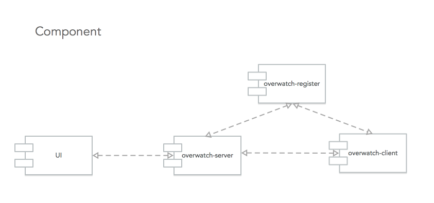
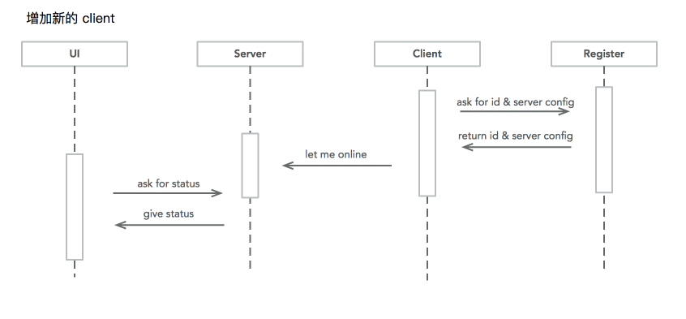
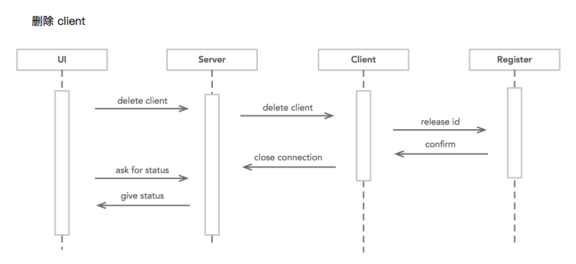
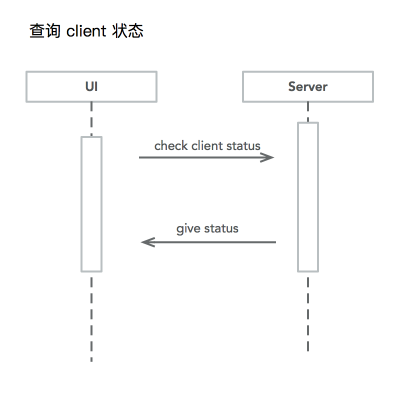
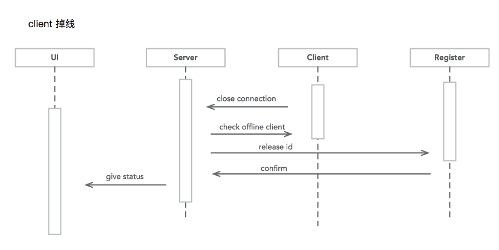
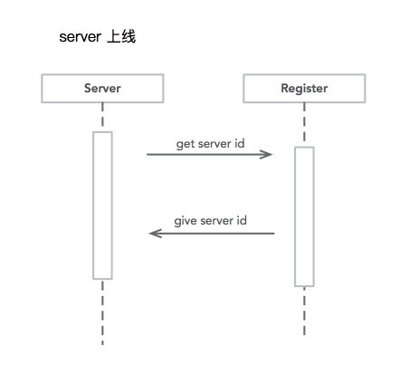

overwatch
===

### 该项目的目标是监控门禁系统。

+ overwatch-client 为模拟的门禁系统客户端，部署在各个虚拟机上，主要负责收集各个系统的状态。
+ overwatch-server 为门禁系统的服务器端，主要负责记录 client 的状态并且入库。
+ overwatch-register 为门禁监控系统的注册服务器，主要任务是给 client 和 server 提供最新状态的配置。

### 系统的设计：

#### 组件图:
> 

#### 时序图:
1. 增加节点
> 

2. 删除节点
> 

3. 查询节点状态
> 

4. 节点掉线
> 

5. 服务器上线
> 

### 组件依赖:

1. 使用 springboot 实现 restful 接口开发
2. 使用 netty 实现连接的良好扩展性
3. 使用 hibernate 实现数据库快速开发

### API 文档
See [@API.md](./API.md)

### 部署文档
See [@Deploy.md](./Deploy.md)
